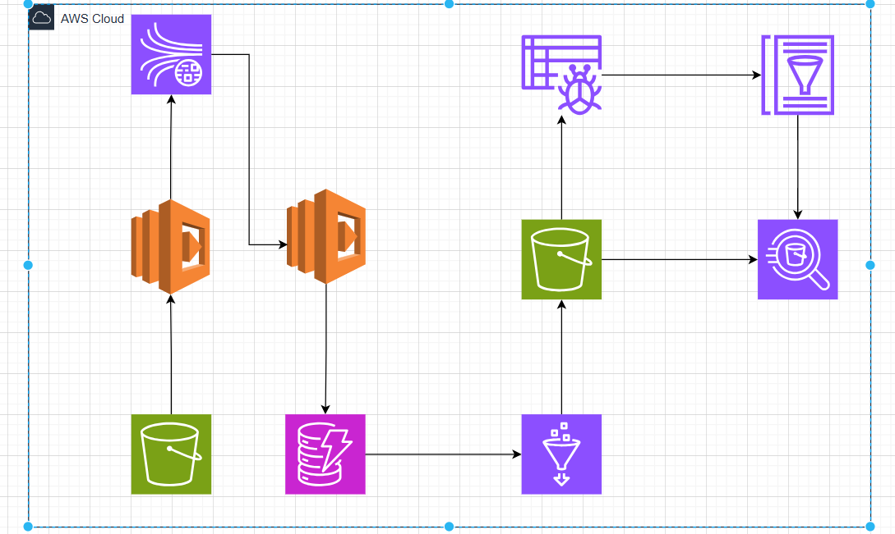

# NSP Bolt Ride – Real-Time Trip Processing Project 🚗💨

This project focuses on building a **real-time trip ingestion and analytics pipeline** for NSP Bolt Ride using AWS-native services. The system ingests trip events via **Amazon Kinesis**, processes them with **AWS Lambda**, stores trip data in **Amazon DynamoDB**, and performs aggregation on trip completion to generate daily KPIs. The KPIs, including total fare, trip count, average fare, maximum fare, and minimum fare, are uploaded to **Amazon S3** for further analysis.

## 🔑 Features

- **Real-Time Data Processing**: Trip data is ingested in real-time via **Kinesis** streams.
- **DynamoDB Integration**: Trip data is stored in **Amazon DynamoDB**.
- **KPI Calculation**: Daily KPIs are calculated using the collected trip data.
- **S3 Storage**: Aggregated KPIs are uploaded to **S3** in a structured format for further analysis.
- **AWS Lambda**: Lambda functions are used for event processing and calculations.
- **CloudWatch Monitoring**: Logs are integrated with **CloudWatch** for monitoring and debugging.

## 🚀 Architecture



### Components:

1. **Kinesis**: Ingests real-time trip data.
2. **Lambda**: Processes trip data, performs KPI calculations, and stores results.
3. **DynamoDB**: Stores trip data for aggregation.
4. **S3**: Stores aggregated KPI data for downstream processing.
5. **CloudWatch**: Logs all Lambda function executions and errors.

## 📄 Setup

### Prerequisites

Before running the project locally, ensure you have the following:

- **AWS CLI** configured on your machine.
- **AWS SAM CLI** installed for local Lambda testing.
- **Docker** (for local testing of AWS services).
- **Python 3.8+** for Lambda functions.

### Installing Dependencies

1. Clone the repository:

   ```bash
   git clone https://github.com/your-username/nsp-bolt-ride.git
   cd nsp-bolt-ride
   ```

2. Install the required dependencies:

   ```bash
   pip install -r requirements.txt
   ```

3. Make sure to set up environment variables:

   ```bash
   export DYNAMODB_TABLE_NAME="your-dynamodb-table"
   export ATHENA_BUCKET_NAME="your-athena-bucket"
   ```

### Running Locally

1. Use **AWS SAM** to validate the Lambda function configuration:

   ```bash
   sam validate --lint
   ```

2. Test the Lambda function locally with sample event data:

   ```bash
   sam local invoke "AggregatorFunction" -e events/test_event.json
   ```

3. Start the local API Gateway for testing:

   ```bash
   sam local start-api
   ```

### Deploying to AWS

Deploy the application to AWS using SAM:

```bash
sam deploy --guided
```

Follow the prompts to set up your stack. This will deploy the entire pipeline to AWS, including the DynamoDB table, Lambda functions, and S3 bucket.

## 🔄 How It Works

1. **Data Ingestion**: Trip data is streamed into **Amazon Kinesis**.
2. **Processing & Aggregation**: AWS Lambda functions process and aggregate the trip data based on the events received from **DynamoDB Streams**.
3. **KPI Calculation**: KPIs like total fare, trip count, and average fare are calculated for each day.
4. **S3 Upload**: The aggregated KPIs are uploaded as JSON files to **Amazon S3**, organized by date.

## 🧪 Testing

The project includes unit tests for the aggregator function. Use **pytest** to run the tests:

```bash
pytest tests/
```

### CI/CD with GitHub Actions

The project is set up to use **GitHub Actions** for continuous integration and deployment. It will automatically:

- Run tests on every pull request.
- Deploy the Lambda functions to AWS when changes are merged into the main branch.

## 🔐 Security Considerations

- Use **IAM Roles** with least privilege for Lambda functions, DynamoDB access, and S3 uploads.
- Secure the S3 bucket with appropriate **bucket policies** to ensure that only authorized entities can access or write to it.
- Implement **CloudWatch Alarms** to monitor any anomalies in Lambda execution or data processing.

## 🛠 Tools & Technologies

- **AWS Lambda**: For serverless compute to process trip data.
- **Amazon DynamoDB**: To store trip data.
- **Amazon Kinesis**: For streaming real-time data.
- **AWS S3**: For storing the results of aggregated KPIs.
- **AWS CloudWatch**: For logging and monitoring Lambda executions.
- **AWS SAM CLI**: For local Lambda function testing and deployment.

## 📅 Roadmap

- [ ] **Integration with other data sources** for enhanced trip analytics.
- [ ] **Real-time dashboard** for trip and KPI visualization.
- [ ] **Optimization** of Lambda function performance.
- [ ] **Advanced analytics** using machine learning on trip data.

## 📣 Contributing

We welcome contributions! If you'd like to contribute to this project, please fork the repository and submit a pull request. Here's how to get started:

1. Fork the repository.
2. Create a new branch (`git checkout -b feature/your-feature`).
3. Make your changes.
4. Commit your changes (`git commit -am 'Add new feature'`).
5. Push to the branch (`git push origin feature/your-feature`).
6. Open a pull request.

## 🙏 Acknowledgments

- **AWS Documentation** for providing resources and tutorials for Lambda, Kinesis, DynamoDB, and S3.
- **Python** for being a great language for data processing.
- **Pandas** for making data manipulation easy.

---

### Key Sections in the README:

1. **Project Overview** with emojis to make it visually appealing.
2. **Features** section to explain the project components.
3. **Architecture** section with a system diagram.
4. **Setup** instructions for installing dependencies, running locally, and deploying to AWS.
5. **Testing** and **CI/CD** sections explaining the testing framework and GitHub Actions setup.
6. **Security** recommendations to ensure proper access controls and monitoring.
7. **Tools & Technologies** used in the project.
8. **Contributing** section to encourage open-source contributions.

